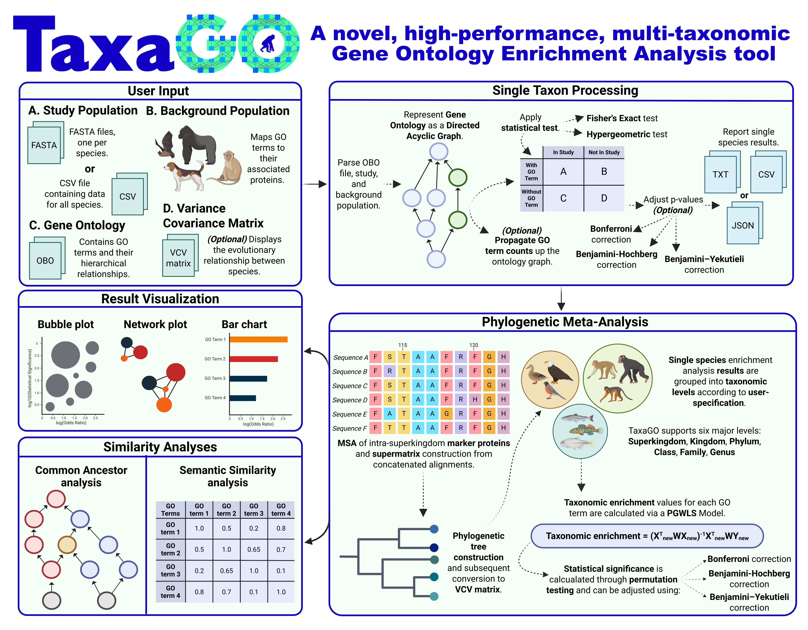

<p align="center">
  
</p>

---

# TaxaGO: a novel, high-performance, multi-taxonomic Gene Ontology Enrichment Analysis tool

<p align="left">
  <a href="https://www.gnu.org/licenses/gpl-3.0"></a>
  <a href="https://www.rust-lang.org"></a>
  </a>
  </p>

## Table of Contents

1.  [Graphical Abstract](#1-graphical-abstract)
2.  [Key Features](#2-key-features)
3.  [Installation](#3-installation)
    * [Prerequisites](#prerequisites)
    * [Required Assets](#required-assets)
    * [From Source](#from-source)
4.  [Usage](#4-usage)
    * [Phylogenetic GO Enrichment Analysis](#taxago)
    * [Semantic Similarity](#semantic-similarity)
    * [Common Ancestor Analysis](#common-ancestors)
    * [Interactive Interface](#taxago-interactive)
5.  [Input File Formats](#4-input-file-formats)
    * [OBO File](#obo-file)
    * [Study Population](#study-population)
    * [Background Population](#background-population)
    * [Lineage File](#lineage-file)
    * [Variance-Covariance (VCV) Matrix](#variance-covariance-vcv-matrix)
6.  [Output File Formats](#6-output-file-formats)
7.  [Interpreting Results](#7-interpreting-results)
8.  [Contributing](#8-contributing)
9.  [License](#9-license)
10. [Citation](#10-citation)
11. [Contact](#11-contact)

## 1. Graphical Abstract

<p align="center">
  
</p>

## 2. Key Features

* **Single-species GOEA :** Performs standard Gene Ontology Enrichment Analysis for a single species or for multiple species at once.
* **Phylogenetically-aware meta-analysis:** Unifying enrichment scores across different taxonomic levels, considering the evolutionary relationships between species.
* **Advanced GO hierarchy handling:** Implementing various count propagation algorithms (Classic, Elim, Weight) to refine enrichment signals.
* **Comprehensive GO toolkit:** Including semantic similarity calculations and common ancestor analysis to further explore GO term relationships.
* **User-friendly interfaces:** Offers a locally hosted interactive user interface for easier data input, parameter tuning and results exploration.
* **High Performance:** Designed for speed and can leverage multiple CPU cores to efficiently handle GOEA across multiple species and/or taxonomic levels simultaneously.

## 3. Installation

### Prerequisites

* **Rust Toolchain:** Version 1.87.0 or later is recommended. Install from the original [Rust website](https://www.rust-lang.org/tools/install).
* **Mermaid CLI (`mmdc`):** Required **only** for the `common-ancestors` tool to generate PDF outputs from Mermaid diagrams. Installation from the official [Mermaid CLI repository](https://github.com/mermaid-js/mermaid-cli).
* **Jemalloc:** TaxaGO uses `jemallocator` for potentially better memory allocation performance.

### Required Assets

TaxaGO uses several data files for its operations. We provide a pre-compiled `taxagp_assets.tar.gz` containing the ontology information, pre-processed background populations for 12,131 species with their corresponding taxonomic and phylogenetic information. The pre-compiled file can be downloaded from [Zenodo](test).

If you want to use your own data, here is a brief description of each one:
* **`go.obo`**: The Gene Ontology OBO file, can be downloaded from the [Gene Ontology Consortium](http://geneontology.org/docs/download-ontology/).
* **`background_pop/`**: A directory containing pre-processed background population files. Each file should be named `{taxon_id}_background.txt` (e.g., `9606_background.txt`).
* **`lineage.txt`**: A tab-separated file mapping NCBI Taxon IDs to their full taxonomic lineage.
* **`vcv.dmat`**: A Variance-Covariance matrix displaying the evolutionary relationship between species. 
See [Input File Formats](#input-file-formats) for additional details.

### From Source

1.  **Install prerequisites.**

2.  **Clone the repository:**
    ```bash
    git clone https://github.com/Georgakopoulos-Soares-lab/TaxaGO
    cd TaxaGO
    ```
3.  **Download `taxago_assets.tar.gz` from Zenodo.**

4.  **Move `taxago_assets.tar.gz` inside the cloned repository.**

5.  **Install TaxaGO:**
    ```bash
    cargo install --path .
    ```
    After installation a `taxago_assets` directory will be created in the `$CARGO_HOME` (specified during Rust installation).

6.  **Once installed, the following executables will be available in your system's PATH:**
    * `taxago`: Main executable for the GOEA analyses.
    * `semantic-similarity`: Tool for calculating GO term semantic similarity.
    * `common-ancestors`: Tool for finding and visualizing common GO ancestors.
    * `taxago-interactive`: Interactive user-interface executable.

## 4. Usage

TaxaGO provides a suite of tools for Gene Ontology Enrichment Analysis. The main executables are `taxago`, `semantic-similarity`, `common-ancestors`, and `taxago-interactive`.

### Gene Ontology Enrichment Analysis: taxago

The `taxago` executable is the primary tool for performing Gene Ontology Enrichment Analysis across single species or taxonomic levels.

### Synopsis:

```bash
taxago [OPTIONS] --study <FILE_OR_DIR> --dir <DIRECTORY>
```
### Options:

**Input Files**
- `-o, --obo <FILE>`: Gene Ontology file in OBO format  
  **Default:** `$CARGO_HOME/taxago_assets/go.obo`

- `-s, --study <FILE_OR_DIRECTORY>`: **Required.** Study population data. Accepts FASTA format (single file for one species, or directory of files for multi-species analysis) or a CSV file containing study populations for one or multiple species

- `-b, --background <DIRECTORY>`: Background population data. Either a single file for custom background or a directory containing background population files for multiple species. Background files must be pre-processed 
  **Default:** `$CARGO_HOME/taxago_assets/background_pop`

**Analysis Parameters**
- `-e, --evidence <CATEGORY>`: Evidence code categories to include from background associations  
  **Options:** `all`, `experimental`, `phylogenetic`, `computational`, `author`, `curator`, `automatic`  
  **Default:** `all`

- `-p, --propagate-counts <METHOD>`: Method for propagating GO term counts up the ontology hierarchy  
  **Options:** `none`, `classic`, `elim`, `weight`  
  **Default:** `none`

- `-t, --test <TEST>`: Statistical test for enrichment analysis  
  **Options:** `fishers`, `hypergeometric`  
  **Default:** `fishers`

**Filtering Thresholds**
- `-m, --min-prot <COUNT>`: Minimum number of proteins required for a GO term to be analyzed. GO terms with associations less than this number will be excluded
  **Default:** `5`

- `-r, --min-score <SCORE>`: Minimum log(Odds Ratio) threshold for GO terms to be reported or further analyzed. GO terms with observed log(Odds Ratio) less than this will be excluded.
  **Default:** `0.2`

- `-a, --alpha <THRESHOLD>`: Statistical significance threshold. Refers to either the corrected or uncorrected p-value
  **Default:** `0.05`

- `-c, --correction-method <METHOD>`: Multiple testing correction method  
  **Options:** `none`, `bonferroni`, `benjamini-hochberg`, `benjamini-yekutieli`  
  **Default:** `bonferroni`

**Meta-Analysis Options**
- `-g, --group-results <LEVEL>`: Group results by taxonomic level to be subjected to  phylogenetic meta-analysis. 
   **Requires** `--vcv-matrix`

- `-l, --lineage-percentage <PERCENTAGE>`: Minimum percentage (range 0.0 to 1.0) of species within a taxonomic group where a GO term must be found enriched 
  **Default:** `0.25` (25%)

- `--vcv-matrix <FILE>`: Variance-covariance matrix file for phylogenetic meta-analysis

- `--permutations <COUNT>`: Number of permutations for phylogenetic meta-analysis  
  **Default:** `1000`

**Output Options**
- `-d, --dir <DIRECTORY>`: **Required.** Output directory for results (individual taxon results and combined analysis). Previous results will be overwritten

- `--save-plots <FORMAT>`: Format for saving enrichment plots. `interactive`: HTML format, `static`: PDF format
  **Options:** `none`, `interactive`, `static`, `both`  
  **Default:** `interactive`

**System Options**
- `--cores <NUMBER>`: Number of CPU cores to use for parallel processing  
  **Default:** All available cores

- `-h, --help`: Display help information
- `-V, --version`: Display version information

### Example:

```bash
taxago -s ./my_study_data/ -d ./taxago_results/ -g kingdom --vcv-matrix ./assets/vcv_matrix.dmat -p classic -c benjamini-hochberg -a 0.01 --save-plots both
```

This command runs TaxaGO using study data from `./my_study_data/`, outputs results to `./taxago_results/`, combines results at the kingdom level using the VCV matrix from `./assets/vcv_matrix.dmat`, uses the classic count propagation, Benjamini-Hochberg for p-value correction with an alpha of 0.01, and saves both interactive HTML and static plots.

### Semantic Similarity: semantic-similarity

Calculates semantic similarity between GO terms.

### Synopsis:

```bash
semantic-similarity [OPTIONS] --terms <GO_TERMS_OR_FILE>
```

### Options:

**Input Files**
- `-o, --obo <OBO_FILE>`: Gene Ontology file in OBO format  
  **Default:** `$CARGO_HOME/taxago_assets/go.obo`

- `-t, --terms <GO_TERMS_OR_FILE>`: **Required.** GO terms to analyze. Either comma-separated terms (e.g., `GO:0016070,GO:0140187`) or path to a file containing one term per line

- `-b, --background <BACKGROUND_DIR>`: Directory containing background population files  
  **Default:** `$CARGO_HOME/taxago_assets/background_pop`

**Analysis Parameters**
- `-i, --ids <TAXON_IDS>`: Comma-separated list of taxonomic IDs to analyze (e.g., `9606,10090`)  
  **Default:** `9606` (Homo Sapiens)

- `-m, --method <METHOD>`: Semantic similarity calculation method  
  **Options:** `resnik`, `lin`, `jiang-conrath`, `wang`  
  **Default:** `resnik`

- `-p, --propagate-counts`: Propagate GO term counts up the ontology hierarchy.
  **Default:** Disabled

**Output Options**
- `-d, --dir <RESULTS_DIR>`: Directory for output files  
  **Default:** `./` (current directory)

- `-h, --help`: Display help information

### Example:

```bash
semantic-similarity -t "GO:0008150,GO:0005575" -i 9606 -m lin -d ./similarity_results/ --propagate-counts
```

This calculates Lin semantic similarity for GO:0008150 and GO:0005575 in taxon 9606, using propagated counts, and saves results to `./similarity_results/`.

### Common Ancestor Analysis: common-ancestors

Finds and visualizes common ancestors of specified GO terms.

### Synopsis:

```bash
common-ancestors [OPTIONS] --terms <GO_TERMS>
```

### Options:

**Input Options**
- `-o, --obo <OBO_FILE>`: Gene Ontology file in OBO format  
  **Default:** `$CARGO_HOME/taxago_assets/go.obo`

- `-t, --terms <GO_TERMS>`: **Required.** Comma-separated list of GO terms (e.g., `GO:0016070,GO:0140187`)

**Output Options**
- `-d, --dir <RESULTS_DIR>`: Output directory for results (generates Mermaid .mmd and .pdf files)  
  **Default:** `./` (current directory)

- `-h, --help`: Display help information

### Example:

```bash
common-ancestors -t "GO:0044237,GO:0006412" -d ./ancestor_analysis/
```

This command analyzes common ancestors for GO:0044237 and GO:0006412 and outputs the Mermaid graph and PDF to the `./ancestor_analysis/` directory.

### Interactive Interface: taxago-interactive

Launches a web-based interactive user interface for TaxaGO.

### Synopsis:

```bash
taxago-interactive
```

### Usage:

1. Run the executable:
   ```bash
   taxago-interactive
   ```

2. A browser window will be opened with the interactive interface. If not, please open your web browser and navigate to `http://127.0.0.1:8080`.

The interactive interface allows you to:

- Upload study population data (CSV or FASTA).
- Upload custom background population files.
- Upload a custom Gene Ontology (OBO) file.
- Configure analysis parameters (statistical test, count propagation, multiple testing correction, thresholds).
- Configure and run Phylogenetic Meta-Analysis (PMA) including VCV matrix upload.
- Filter by evidence codes.
- Initiate the analysis and view results, including interactive plots.
- Download results in various formats.
- Perform Common Ancestor and Semantic Similarity analyses through the UI.

## 5. Input File Formats

TaxaGO utilizes several specific file formats for its input data. If you are using the pre-compiled assets, these files are already included and formatted. If providing your own data, please adhere to the following formats:

### OBO File (`go.obo`)

* **Description**: The Gene Ontology OBO file contains the structure and definitions of GO terms.
* **Format**: Standard OBO format as provided by the [Gene Ontology Consortium](https://owlcollab.github.io/oboformat/doc/obo-syntax.html).
* **Parsing Details**: The parser extracts GO term ID, name, namespace, definition, obsolescence status, and the relationships: `is_a`, `part_of`, `regulates`, `positively_regulates`, `negatively_regulates`, and `occurs_in`. Obsolete terms are ignored.

### Study Population

The study population represents the set of proteins/genes of interest for your analysis. TaxaGO can accept study population data in two formats:

1.  **CSV File**
    * **Description**: A single CSV file can provide study populations for multiple species.
    * **Format**:
        * The header row must contain NCBI Taxon IDs for each species.
        * Subsequent rows list protein identifiers (UniProt entry names) belonging to the study set for the corresponding taxon ID in that column.
        * If a species does not have a protein for a given row, the cell can be left empty.
    * **Example**:
        ```csv
        9606,10090,7227
        P12345,Q67890,R13579
        P24680,,S24680
        P36912,Q79135,
        ```
    * **Note**: A CSV file can be used even for single species analysis.

2.  **FASTA Files**

    * **Description**: Provide one FASTA-like file per species, or a directory containing multiple such files.

    * **Format**:
        * The file should begin with a header line starting with `>` followed immediately by the NCBI Taxon ID of the species.
        * Subsequent lines should list the protein identifiers (e.g., UniProt accessions), one per line.
        * The parser expects the Taxon ID to be the first line and proteins to follow. If a line does not start with `>` and is not empty, it's treated as a protein.

    * **Example (`9606_study.fasta`):**
        ```fasta
        >9606
        P12345
        P24680
        P36912
        ```

    * **Note on Directory Input**: If a directory path is provided for the study population, TaxaGO will attempt to parse all `.fa` and `.fasta` files within that directory, assuming each file corresponds to a single species and follows the format above.

### Background Population

* **Description**: These files provide the background set of proteins and their GO annotations for each species. Each file is specific to one species.

* **Location**: Typically stored in a directory (e.g., `background_pop/` provided via the `-b` option). The background population parser can also accept singe files, if the user intends perform single species GOEA using TaxaGO.

* **Naming Convention**: Files must be named `{taxon_id}_background.txt` (e.g., `9606_background.txt`).

* **Format**: Tab-separated values with three columns per line:
    1.  Protein Identifier (UniProt entry name).
    2.  GO Term ID (e.g., `GO:0005575`).
    3.  Evidence Code (e.g., `EXP`, `IEA`).
    * The parser can filter annotations based on evidence code categories (Experimental, Phylogenetic, Computational, Author, Curator, Electronic).

* **Example (`9606_background.txt`):**
    ```tsv
    P12345	GO:0005575	EXP
    P12345	GO:0008150	IEA
    P98765	GO:0003677	IDA
    ```

### Lineage File

* **Description**: A tab-separated file mapping NCBI Taxon IDs to their full taxonomic lineage. This file is used only when phylogenetic meta-analysis is performed.

* **Format**:
    * The file should have a header row, which is skipped during parsing.
    * Each subsequent line should contain:
        1.  NCBI Taxon ID.
        2.  Species Name.
        3.  Lineage information, starting from Genus up to Superkingdom, each level separated by a tab. The expected order is: Genus, Family, Order, Class, Phylum, Kingdom, Superkingdom.

* **Example**:
    ```tsv
    Tax_ID	Species	Genus	Family	Order	Class	Phylum	Kingdom	Superkingdom
    9606	Homo_sapiens	Homo	Hominidae	Primates	Mammalia	Chordata	Metazoa	Eukaryota
    10090	Mus_musculus	Mus	Muridae	Rodentia	Mammalia	ChordataMetazoa	Eukaryota
    ```

### Variance-Covariance (VCV) Matrix

* **Description**: A matrix representing the evolutionary relationships (phylogenetic distances) between species. This is required for the phylogenetic meta-analysis feature.

* **Format**: A CSV (Comma Separated Values) file.
    * The first column must be named `taxa` and contain the NCBI Taxon IDs of the species.
    * Subsequent columns should also be named with NCBI Taxon IDs.
    * The matrix should be symmetrical, with values representing the variance or covariance between the species in the corresponding row and column.

* **Example:**
    ```csv
    taxa,9606,10090,7227
    9606,0.0,0.15,0.65
    10090,0.15,0.0,0.70
    7227,0.65,0.70,0.0
    ```

* **Note**: TaxaGO provides three precomputed VCV matrix, one for each of the three main cellular Superkingdoms. The user can create a custom VCV matrix from a Newick (`.nwk`) phylogenetic tree containing branch lengths using the [`create_vcv.R`](helper_scripts/create_vcv.R) script.

## 6. Output File Formats

TaxaGO generates several output files depending on the analysis performed and options selected. All results are typically saved within the directory specified by the `--dir` or `-d` option.

### Main GOEA Results (`taxago` executable)

When running the `taxago` executable, results are organized into subdirectories within your specified output directory:

1.  **Single Taxon Results:**

    * **Location**: `<output_dir>/single_taxon_results/`

    * **Filename**: `{species_name}_GOEA_results.txt` (e.g., `Homo_sapiens_GOEA_results.txt`).

    * **Format**: Tab-separated values (TSV) file with the following columns:
        * `GO Term ID`: The GO identifier (e.g., `GO:0005575`).
        * `Name`: The descriptive name of the GO term.
        * `Namespace`: The GO namespace (e.g., `Biological Process`, `Molecular Function`, `Cellular Component`).
        * `log(Odds Ratio)`: The calculated enrichment score for the term, formatted to 3 decimal places.
        * `Statistical significance`: The p-value (or adjusted p-value if correction was applied), formatted in scientific notation to 5 decimal places.

    * Only non-obsolete GO terms meeting the significance and odds ratio thresholds are included.

2.  **Combined Taxonomy Results (if `-g` option is used):**

    * **Location**: `<output_dir>/combined_taxonomy_results/`

    * **Filename**: `{taxonomy_level_name}_GOEA_results.txt` (e.g., `Metazoa_GOEA_results.txt`).

    * **Format**: Same TSV format as single taxon results:
        * `GO Term ID`: The GO identifier (e.g., `GO:0005575`).
        * `Name`: The descriptive name of the GO term.
        * `Namespace`: The GO namespace (e.g., `Biological Process`, `Molecular Function`, `Cellular Component`).
        * `log(Odds Ratio)`: The calculated enrichment score obtained from the phylogenetic meta-analysis, formatted to 3 decimal places.
        * `Statistical significance`: The p-value (or adjusted p-value if correction was applied), obtained using permutation testing within the phylogenetic meta-analysis component, formatted in scientific notation to 5 decimal places.

    * These files are generated if results are grouped by a taxonomic level using the `-g` option.

3.  **Enrichment Plots (if `--save-plots` is not `none`):**

    * **Location**:
        * For single taxon analysis: `<output_dir>/single_taxon_results/plots/{Namespace}/`
        * For combined taxonomy analysis: `<output_dir>/combined_taxonomy_results/plots/{Namespace}/`
        * Where `{Namespace}` can be `Biological_Process`, `Molecular_Function`, or `Cellular_Component`.

    * **Filenames**:
        * `{taxon_name}_bar_plot.{html|pdf}`
        * `{taxon_name}_bubble_plot.{html|svg}`
        * `{taxon_name}_network_plot.{html|svg}`
        * The extension depends on the `--save-plots` option (`interactive` for HTML, `static` for PDF/SVG, `both` for both).

    * **Plot Details**:

        * **Bar Plot**: Displays the top 20 most statistically significant GO terms sorted by their log(Odds Ratio). Bar color intensity corresponds to the -log10(Statistical significance).

        * **Bubble Plot**: Shows enriched GO terms where the x-axis is log(Odds Ratio), y-axis is -log10(Statistical significance), and bubble size corresponds to the number of proteins in the study set associated with the term (or number of species for combined results).

        * **Network Plot**: Visualizes relationships between enriched GO terms. Nodes represent GO terms (colored by log(Odds Ratio), sized by number of associated proteins/species) and edges represent Jaccard similarity based on shared proteins (Jaccard index >= 0.25). Up to 4 largest communities are plotted using the Fruchterman-Reingold layout algorithm.

### Semantic Similarity Results (`semantic-similarity` executable)

* **Location**: User-specified output directory (`-d` option).

* **Filename**: `similarity_{method}_taxon_{taxon_id}.tsv` (e.g., `similarity_resnik_taxon_9606.tsv`).

* **Format**: A tab-separated values (TSV) matrix.
    * The first row (header) and first column contain the GO Term IDs provided for comparison.
    * Each cell `(TermA, TermB)` in the matrix contains the calculated semantic similarity score between TermA and TermB using the specified method. Scores are typically formatted to 6 decimal places.

### Common Ancestor Analysis Results (`common-ancestors` executable)

* **Location**: User-specified output directory (`-d` option), or `results/` if run via the interactive interface.

* **Filenames**:
    * `common_ontology_graph.mmd`: A text file in Mermaid Markdown format describing the GO term hierarchy leading to common ancestors.
    * `common_ontology_graph.pdf`: A PDF rendering of the Mermaid graph. This file is only generated if the `mmdc` (Mermaid CLI) tool is installed and accessible in the system's PATH.

* **Content**: The graph displays the input GO terms and their ancestors up to the root(s), highlighting the first common ancestor(s). Nodes are styled based on their namespace and whether they are input terms or common ancestors. Edges represent different types of relationships (e.g., `is_a`, `part_of`).

### Interactive Interface Downloads (`taxago-interactive` executable)

When using the `taxago-interactive` web interface, the displayed results table (either single taxon or combined taxonomy) can be downloaded in various formats via the "Download Results" button.

* **Location**: Downloads to the user's browser default download location.

* **Filename**: Based on the original species or taxonomy level name (e.g., `Homo_sapiens.csv`, `Metazoa.json`).

* **Formats**:
    * **CSV**: Contains the results table with a header row.
        * Header: `GO Term ID, Name, Namespace, log(Odds Ratio), Statistical significance`.
    * **TSV**: Same content as CSV, but tab-delimited.
    * **JSON**: An array of JSON objects, where each object represents an enriched GO term and its associated data fields.

## 7. Interpreting Results

Understanding the output of TaxaGO involves interpreting statistical values and visualizations. Here's a guide to help you make sense of your Gene Ontology Enrichment Analysis (GOEA) results.

### Main Enrichment Results (TSV Files)

The core output of a TaxaGO analysis is a tab-separated values (TSV) file for each species or combined taxonomic group. Each row represents a Gene Ontology (GO) term that was found to be enriched. The key columns are:

* **`GO Term ID`**: The unique identifier for the GO term (e.g., `GO:0005575`). You can use this ID to look up more information on databases like [QuickGO](https://www.ebi.ac.uk/QuickGO/) or [AmiGO](http://amigo.geneontology.org/).

* **`Name`**: The human-readable name of the GO term (e.g., "cellular_component").

* **`Namespace`**: Indicates the domain of ontology the term belongs to:
    * `Biological Process`: Refers to a series of molecular events or a biological pathway.
    * `Molecular Function`: Describes the biochemical activity of a gene product (TaxaGO supports only proteins).
    * `Cellular Component`: Refers to the part of a cell where a gene product (TaxaGO supports only proteins) acts.

* **`log(Odds Ratio)`**: This value indicates the strength and direction of enrichment.
    * A **positive log(Odds Ratio)** suggests that the GO term is over-represented (enriched) in your study population compared to the background population. Larger positive values indicate stronger enrichment.
    * The `--min-score` parameter (default: 0.2) filters results based on this value.

* **`Statistical significance`**: This is the p-value (or adjusted p-value if multiple testing correction was applied) associated with the enrichment score.
    * A **lower p-value** indicates stronger statistical evidence against the null hypothesis (i.e., that the term is not enriched).
    * Terms with p-values below your chosen significance threshold (alpha, default: 0.05, potentially adjusted) are generally considered significantly enriched.

**Important Considerations:**

* **Multiple Testing Correction (`-c` and `-a` options)**: If you enabled a correction method (e.g., Bonferroni, Benjamini-Hochberg), the reported p-values are adjusted to account for testing many GO terms simultaneously. This helps to control the false discovery rate.

* **Count Propagation (`-p` option)**: If you used a count propagation method (`classic`, `elim`, `weight`), the enrichment scores reflect this hierarchical adjustment.
    * **Classic**: Counts for a term include counts from all its child terms.
    * **Elim**: Aims to remove less specific significant terms if their significance is primarily due to their more specific significant children.
    * **Weight**: Adjusts the contribution of proteins to parent terms based on the significance of their association with child terms.

* **Phylogenetic Meta-Analysis Results (`-g` and `--vcv-matrix` options)**: If you performed a combined analysis across a taxonomic level with a VCV matrix, the `log(Odds Ratio)` and `Statistical significance` in the combined results file represent a meta-analyzed score that considers the evolutionary relationships between the species within that group. This provides a unified enrichment score for the taxonomic group.

### Enrichment Plots

If `--save-plots` was enabled, TaxaGO generates various plots to help visualize enrichment results. These are typically found in a `plots` subdirectory within your single taxon or combined taxonomy results folders.

1.  **Bar Plot (`*_bar_plot.{html|pdf}`)**
    * **What it shows**: The top 20 most significantly enriched GO terms.
    * **Interpretation**:
        * Each bar represents a GO term.
        * The **length of the bar** corresponds to the `log(Odds Ratio)` (enrichment strength).
        * The **color of the bar** typically represents the `-log10(Statistical significance)`, with more intense colors indicating higher significance (lower p-values).
        * This plot is useful for quickly identifying the most prominent and statistically robust enrichments.

2.  **Bubble Plot (`*_bubble_plot.{html|svg}`)**
    * **What it shows**: A scatter plot where each bubble is a GO term.
    * **Interpretation**:
        * **X-axis**: `log(Odds Ratio)`.
        * **Y-axis**: `-log10(Statistical significance)`. Terms higher up are more significant.
        * **Bubble Size**: Proportional to a size statistic, such as the number of proteins from your study set annotated to that GO term (for single species analysis) or the number of species within a taxonomic group where the term is enriched (for combined results).
        * This plot helps identify terms that are both highly significant and have a strong enrichment score, while also giving a sense of the number of genes/species contributing to the enrichment. Top 10 significant terms are annotated.

3.  **Network Plot (`*_network_plot.{html|svg}`)**
    * **What it shows**: Relationships between enriched GO terms based on shared proteins/genes. Up to 4 largest connected components (communities) are typically plotted.
    * **Interpretation**:
        * **Nodes**: Represent enriched GO terms.
            * *Node Color*: Corresponds to the `log(Odds Ratio)`.
            * *Node Size*: Proportional to the size statistic (similar to the bubble plot).
        * **Edges**: Connect GO terms that share a significant number of proteins (Jaccard index based, default threshold 0.25).
            * *Edge Width*: Represents the strength of the Jaccard similarity.
        * This plot helps to identify clusters of functionally related GO terms, suggesting broader biological themes or pathways that are over-represented in your study set. The Fruchterman-Reingold algorithm is used for layout.

### Semantic Similarity Results (TSV File)

* **Output**: A matrix of similarity scores between pairs of GO terms.
* **Interpretation**:
    * Scores range differently depending on the method (`Resnik`, `Lin`, `Jiang-Conrath`, `Wang`).
    * Generally, **higher scores indicate greater semantic similarity** between two GO terms, meaning they are more closely related in function or cellular context based on the GO hierarchy and/or annotation statistics.
    * Self-similarity (e.g., GO:A vs GO:A) is typically the maximum possible score (often 1.0 for normalized methods like Wang or Lin, or the term's Information Content for Resnik).
    * **Wang's method** is based on the graph structure of the GO, considering the types of relationships (only `is_a` and `part_of`) and their weights.
    * **Resnik, Lin, and Jiang-Conrath** are Information Content (IC)-based methods. IC is derived from the frequency of a term's usage in annotations; rarer terms have higher IC. They rely on finding the Most Informative Common Ancestor (MICA).

### Common Ancestor Analysis Results (Mermaid Graph & PDF)

* **Output**: A visual representation of the GO hierarchy connecting the input GO terms through their common ancestors.
* **Interpretation**:
    * The graph helps you trace the relationships between the selected GO terms.
    * Nodes are GO terms, styled by namespace and highlighting input terms and the "first common ancestor(s)".
    * Edges represent relationships like `is_a` (black), `part_of` (magenta), `regulates` (blue), etc., with distinct colors/styles.
    * Identifying the common ancestors, especially the Most Informative Common Ancestor (MICA) or the first common one displayed, can reveal the shared biological context or the closest point of functional convergence between the terms.

By combining the statistical outputs with these visualizations and understanding the underlying methods, you can gain deeper insights into the biological significance of your protein lists.

## 8. Contributing

We warmly welcome contributions to TaxaGO! Whether it's reporting a bug, suggesting a new feature, improving documentation, or submitting code changes, your help is greatly appreciated and valued.

To ensure a smooth and effective collaboration process, please consider the following guidelines:

**Ways to Contribute:**

* **Reporting Bugs:** If you encounter a bug, please open an issue on our [GitHub Issues page](https://github.com/Georgakopoulos-Soares-lab/TaxaGO/issues). Describe the bug in detail, including steps to reproduce it, the expected behavior, and the actual behavior. Include your operating system, Rust version.
* **Suggesting Enhancements or New Features:** We are always open to new ideas! Please open an issue on GitHub to suggest an enhancement or new feature. Provide a clear and detailed explanation of the feature and why it would be beneficial to TaxaGO.
* **Improving Documentation:** Good documentation is key. If you find areas that are unclear, incorrect, or could be improved, please let us know by opening an issue or submitting a pull request with your suggested changes.
* **Submitting Code Changes (Pull Requests):**
    1.  **Fork the repository** on GitHub.
    2.  **Create a new branch** for your feature or bug fix: `git checkout -b feature/your-feature-name` or `git checkout -b fix/your-bug-fix-name`.
    3.  **Make your changes.** Ensure your code adheres to the existing style and that you add relevant tests.
    4.  **Test your changes thoroughly.**
    5.  **Commit your changes** with a clear and descriptive commit message: `git commit -m "feat: Add new feature X"`.
    6.  **Push your branch** to your forked repository: `git push origin feature/your-feature-name`.
    7.  **Open a Pull Request (PR)** against the `main` branch of the `Georgakopoulos-Soares-lab/TaxaGO`repository.
    8.  Clearly describe the changes in your PR, why they were made, and reference any related issues.

We look forward to your contributions and to making TaxaGO a better tool together!

## 9. License

This project is licensed under the [GNU GPL v3](https://www.gnu.org/licenses/gpl-3.0.en.html).

See the [LICENSE.txt](LICENSE.txt) file for further details.

## 10. Citation

The citation will be placed here after publication.

## 11. Contact
For any questions or support, please contact:
* izg5139@psu.edu
* left.bochalis@gmail.com
* antonpapg@gmail.com