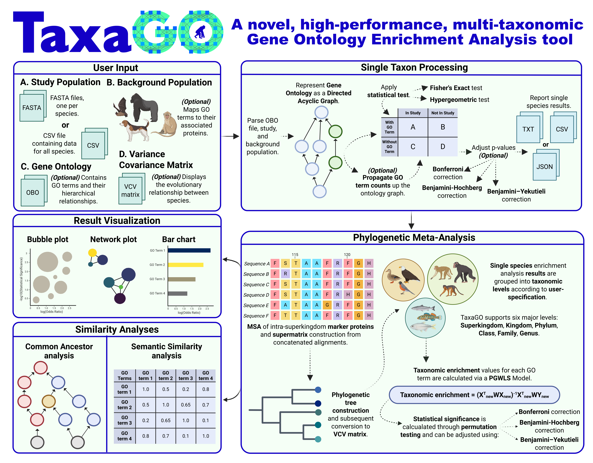

<p align="center">
  
</p>

---

# TaxaGO: a novel, high-performance, multi-taxonomic Gene Ontology Enrichment Analysis tool

<p align="left">
  <a href="https://www.gnu.org/licenses/gpl-3.0"></a>
  <a href="https://www.rust-lang.org"></a>
  </a>
  </p>


## Table of Contents

1.  [Graphical Abstract](#abstract)
2.  [Key Features](#key-features)
3.  [Installation](#installation)
    * [Prerequisites](#prerequisites)
    * [Required Assets](#required-assets)
    * [From Source](#from-source)
4.  [Usage](#usage)
    * [Phylogenetic GO Enrichment Analysis](#taxago)
    * [Semantic Similarity](#semantic-similarity)
    * [Common Ancestor Analysis](#common-ancestors)
    * [Interactive Interface](#taxago-interactive)
5.  [Input File Formats](#input-file-formats)
    * [OBO File](#obo-file)
    * [Study Population](#study-population)
    * [Background Population](#background-population)
    * [Lineage File](#lineage-file)
    * [Variance-Covariance (VCV) Matrix](#variance-covariance-vcv-matrix)
6.  [Output File Formats](#output-file-formats)
7.  [Interpreting Results](#interpreting-results)
8.  [Contributing](#contributing)
9. [License](#license)
10. [Citation](#citation)
11. [Contact](#contact)

## 1. Graphical Abstract

<p align="center">
  
</p>

## 2. Key Features

* **Single-species GOEA :** Performs standard Gene Ontology Enrichment Analysis for a single species or for multiple species at once.
* **Phylogenetically-aware meta-analysis:** Unifying enrichment scores across different taxonomic levels, considering the evolutionary relationships between species.
* **Advanced GO hierarchy handling:** Implementing various count propagation algorithms (Classic, Elim, Weight) to refine enrichment signals.
* **Comprehensive GO toolkit:** Including semantic similarity calculations and common ancestor analysis to further explore GO term relationships.
* **User-friendly interfaces:** Offers a locally hosted interactive user interface for easier data input, parameter tuning and results exploration.
* **High Performance:** Designed for speed and can leverage multiple CPU cores to efficiently handle GOEA across multiple species and/or taxonomic levels simultaneously.

## 3. Installation

### Prerequisites

* **Rust Toolchain:** Version 1.87.0 or later is recommended. Install from the original [Rust website](https://www.rust-lang.org/tools/install).
* **Mermaid CLI (`mmdc`):** Required **only** for the `common-ancestors` tool to generate PDF outputs from Mermaid diagrams. Installation from the official [Mermaid CLI repository](https://github.com/mermaid-js/mermaid-cli).
* **Jemalloc:** TaxaGO uses `jemallocator` for potentially better memory allocation performance.

### Required Assets

TaxaGO uses several data files for its operations. We provide a pre-compiled `taxagp_assets.tar.gz` containing the ontology information, pre-processed background populations for 12,131 species with their corresponding taxonomic and phylogenetic information. The pre-compiled file can be downloaded from [Zenodo](test).

If you want to use your own data, here is a brief description of each one:
* **`go.obo`**: The Gene Ontology OBO file, can be downloaded from the [Gene Ontology Consortium](http://geneontology.org/docs/download-ontology/).
* **`background_pop/`**: A directory containing pre-processed background population files. Each file should be named `{taxon_id}_background.txt` (e.g., `9606_background.txt`).
* **`lineage.txt`**: A tab-separated file mapping NCBI Taxon IDs to their full taxonomic lineage.
* **`vcv.dmat`**: A Variance-Covariance matrix displaying the evolutionary relationship between species. 
See [Input File Formats](#input-file-formats) for additional details.

### From Source

1.  **Clone the repository:**
    ```bash
    git clone https://github.com/Georgakopoulos-Soares-lab/TaxaGO
    cd TaxaGO
    ```
2.  **Download `taxago_assets.tar.gz` from Zenodo.**

3.  **Move `taxago_assets.tar.gz` inside the cloned repository**

4.  **Install TaxaGO:**
    ```bash
    cargo install --path .
    ```

5.  **Once installed, the following executables will be available in your system's PATH:**
    * `taxago`: Main executable for the GOEA analyses.
    * `semantic-similarity`: Tool for calculating GO term semantic similarity.
    * `common-ancestors`: Tool for finding and visualizing common GO ancestors.
    * `taxago-interactive`: Interactive user-interface executable.

## 4. Usage

## 5. Input File Formats

## 6. Output File Formats

## 7. Interpreting Results

## 8. Contributing

We warmly welcome contributions to TaxaGO! Whether it's reporting a bug, suggesting a new feature, improving documentation, or submitting code changes, your help is greatly appreciated and valued.

To ensure a smooth and effective collaboration process, please consider the following guidelines:

**Ways to Contribute:**

* **Reporting Bugs:** If you encounter a bug, please open an issue on our [GitHub Issues page](https://github.com/Georgakopoulos-Soares-lab/TaxaGO/issues). Describe the bug in detail, including steps to reproduce it, the expected behavior, and the actual behavior. Include your operating system, Rust version.
* **Suggesting Enhancements or New Features:** We are always open to new ideas! Please open an issue on GitHub to suggest an enhancement or new feature. Provide a clear and detailed explanation of the feature and why it would be beneficial to TaxaGO.
* **Improving Documentation:** Good documentation is key. If you find areas that are unclear, incorrect, or could be improved, please let us know by opening an issue or submitting a pull request with your suggested changes.
* **Submitting Code Changes (Pull Requests):**
    1.  **Fork the repository** on GitHub.
    2.  **Create a new branch** for your feature or bug fix: `git checkout -b feature/your-feature-name` or `git checkout -b fix/your-bug-fix-name`.
    3.  **Make your changes.** Ensure your code adheres to the existing style and that you add relevant tests.
    4.  **Test your changes thoroughly.**
    5.  **Commit your changes** with a clear and descriptive commit message: `git commit -m "feat: Add new feature X"`.
    6.  **Push your branch** to your forked repository: `git push origin feature/your-feature-name`.
    7.  **Open a Pull Request (PR)** against the `main` branch of the `Georgakopoulos-Soares-lab/TaxaGO`repository.
    8.  Clearly describe the changes in your PR, why they were made, and reference any related issues.

We look forward to your contributions and to making TaxaGO a better tool together!

## 9. License

This project is licensed under the **GNU GPL v3**.

See the [LICENSE.txt](LICENSE.txt) file for further details.

## 10. Citation

The citation will be placed here after publication.

## 11. Contact
For any questions or support, please contact:
* izg5139@psu.edu
* left.bochalis@gmail.com
* antonpapg@gmail.com